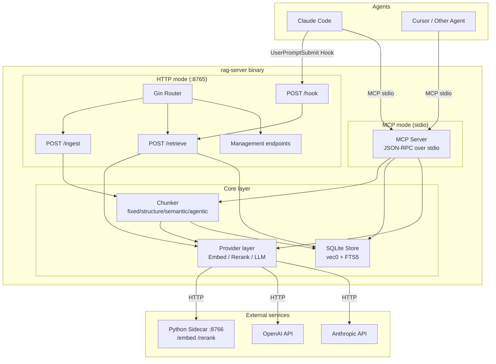
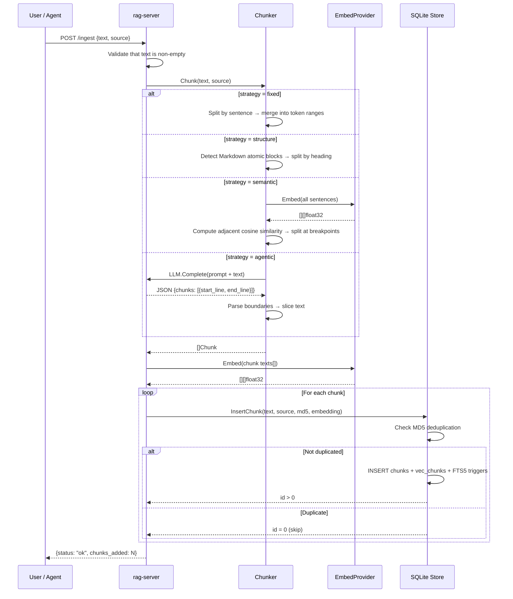
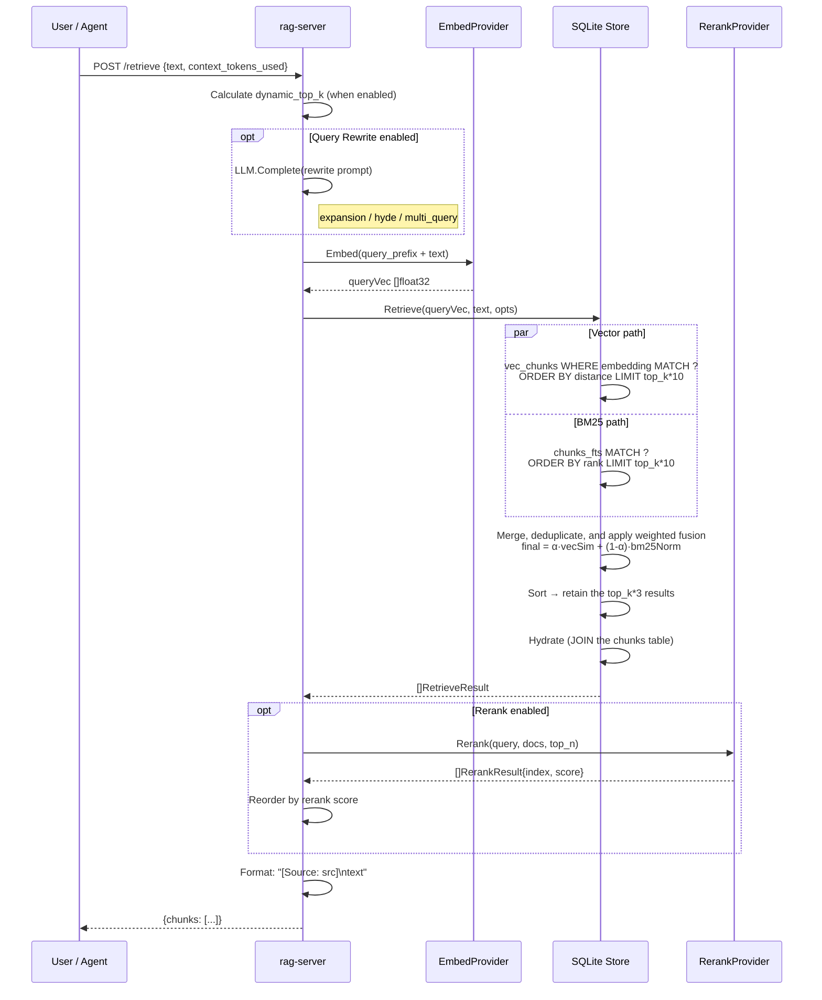
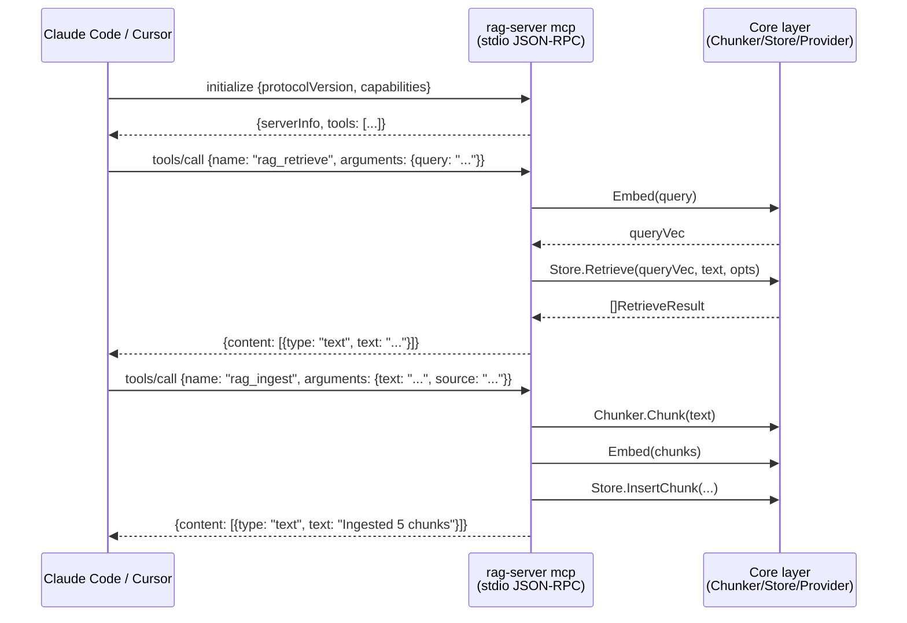
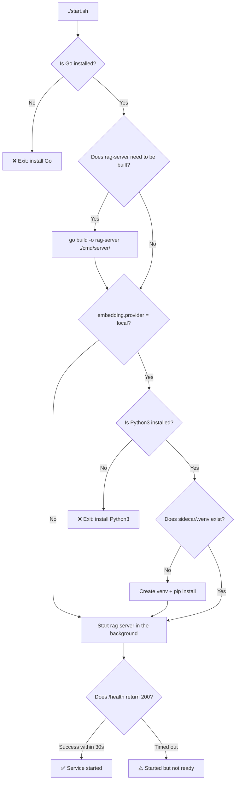
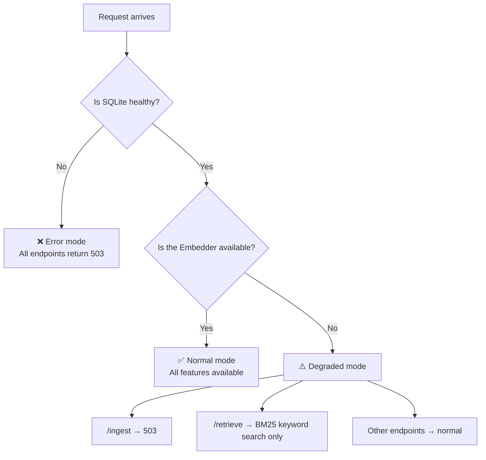
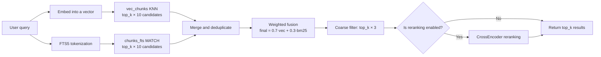
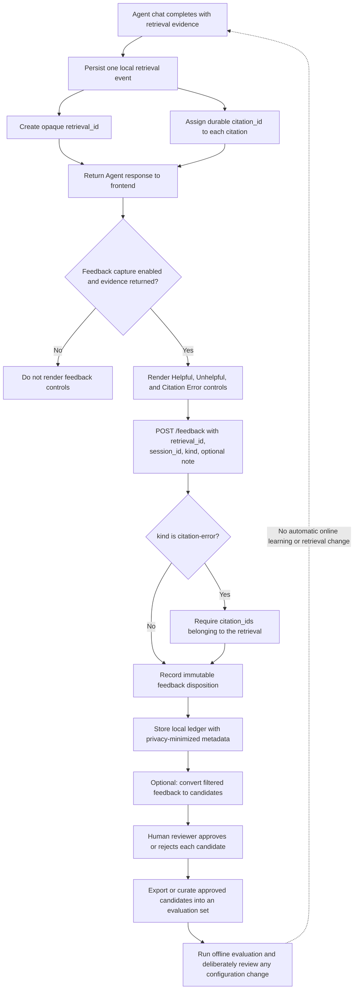

# Local RAG — System Diagrams

## 1. System Architecture Overview



---

## 2. Ingest Sequence Diagram



---

## 3. Retrieval Sequence Diagram



---

## 4. Hook Automatic Retrieval Sequence Diagram

```mermaid
sequenceDiagram
    participant Claude as Claude Code
    participant Hook as hook.sh
    participant Server as rag-server
    participant Store as SQLite Store

    Claude->>Claude: User enters a prompt
    Claude->>Hook: UserPromptSubmit event<br/>(stdin: {prompt, cwd, transcript_path})

    Hook->>Server: POST /hook (curl --max-time 3)

    Server->>Server: Check the <cwd>/.rag-mode file
    alt .rag-mode does not exist
        Server-->>Hook: {additional_context: ""}
        Hook-->>Claude: (no output; remain silent)
    else .rag-mode exists
        Server->>Server: doRetrieve(prompt)
        Note right of Server: Run the full retrieval flow
        Server-->>Hook: {additional_context: "[RAG automatic retrieval results]\n..."}
        Hook-->>Claude: Output additionalContext JSON
        Claude->>Claude: Model sees: system + RAG results + user prompt
    end

    Note over Hook: Any error → exit 0 (silent; do not block the conversation)
```

---

## 5. MCP Call Sequence Diagram



---

## 6. Startup Flow Diagram



---

## 7. Internal Server Startup Flow Diagram

```mermaid
flowchart TD
    MAIN[main()] --> LOAD_CFG[Load config.yaml]
    LOAD_CFG --> CHECK_MODE{os.Args[1] == "mcp"?}

    CHECK_MODE -->|Yes| MCP_MODE
    CHECK_MODE -->|No| HTTP_MODE

    subgraph MCP_MODE[MCP mode]
        M1[InitLogger error/text] --> M2[Start Sidecar]
        M2 --> M3[Initialize Provider]
        M3 --> M4[Initialize Store]
        M4 --> M5[Initialize Chunker]
        M5 --> M6[Register MCP Tools]
        M6 --> M7[server.Run StdioTransport<br/>Block while waiting for a client]
    end

    subgraph HTTP_MODE[HTTP mode]
        H1[InitLogger] --> H2[Start Sidecar]
        H2 --> H3[Initialize Provider]
        H3 --> H4[Initialize Store]
        H4 --> H5[Initialize Chunker]
        H5 --> H6[Build Handler]
        H6 --> H7[Register 28 Gin routes]
        H7 --> H8[Listen for SIGINT/SIGTERM]
        H8 --> H9[r.Run :8765]
    end
```

---

## 8. Sidecar Lifecycle Flow Diagram

```mermaid
flowchart TD
    START[Manager.Start] --> CHECK{provider == "local"?}
    CHECK -->|No| SKIP[Skip; do not start the sidecar]
    CHECK -->|Yes| SPAWN[Start python3 sidecar/main.py --port 8766]

    SPAWN --> POLL{Poll /health every 500ms}
    POLL -->|200 OK| READY[✅ Sidecar ready]
    POLL -->|Timed out after 30s| FAIL[❌ Startup failed; kill the process]

    READY --> LOOP[Background health-check loop<br/>Probe every 10s]
    LOOP --> HEALTH_OK{/health 200?}
    HEALTH_OK -->|Yes| RESET_FAIL[failures = 0]
    HEALTH_OK -->|No| INC_FAIL[failures++]
    RESET_FAIL --> LOOP
    INC_FAIL --> TOO_MANY{failures >= 3?}
    TOO_MANY -->|No| LOOP
    TOO_MANY -->|Yes| RESTART[Kill + restart]
    RESTART --> SPAWN
```

---

## 9. Degradation Strategy Flow Diagram



---

## 10. Hybrid Retrieval Scoring Flow Diagram



---

## 11. Agent frontend interaction (HTTP/JSON)

The browser-facing Agent API is synchronous REST over HTTP with JSON request
and response bodies. It does not use WebSocket or Server-Sent Events for
token streaming. The server enables CORS for browser clients. MCP over stdio
is a separate integration path and is not used by this flow.

```mermaid
sequenceDiagram
    participant UI as Browser frontend
    participant API as rag-server HTTP API
    participant Session as SQLite session store
    participant Loop as Agent tool loop
    participant LLM as LLM provider

    UI->>API: POST /agent/session {metadata?}
    API->>Session: Create session
    Session-->>API: session_id
    API-->>UI: 200 {session_id}

    UI->>API: POST /agent/chat {session_id, message}
    API->>Loop: ChatWithResult(session_id, message)
    Loop->>Session: Load prior messages; append user message
    Loop->>LLM: Complete with the fixed tool registry

    alt Final answer without a tool call
        LLM-->>Loop: Final text
        Loop->>Session: Append assistant message
        Loop-->>API: completed response
    else Read-only retrieval tool call
        LLM-->>Loop: rag_retrieve(query, top_k)
        Loop->>Loop: Validate and execute retrieval
        Loop->>LLM: Tool result and evidence
        LLM-->>Loop: Final text
        Loop-->>API: completed response with citations
    else Mutating tool call
        LLM-->>Loop: ingest, delete source, or rebuild index
        Loop-->>API: permission_required and permission_request
    end

    API-->>UI: JSON response: response, citations, outcome,<br/>rounds, tool_calls, and optional permission_request/retrieval_id
```

---

## 12. Human-in-the-loop approval for Agent mutations

Only the three knowledge-base mutations require approval: `rag_ingest`,
`rag_delete_source`, and `rag_index_rebuild`. The permission request exposes
the operation but deliberately does not expose the tool arguments, because an
ingest request can contain document content.

```mermaid
flowchart TD
    A[Agent requests a fixed registry tool] --> B{Does the tool mutate the knowledge base?}
    B -->|No: rag_retrieve| C[Validate arguments and execute in the Agent loop]
    C --> D[Return evidence to the model and continue this chat request]

    B -->|Yes| E[Stop the current chat request]
    E --> F[Return outcome: permission_required]
    F --> G[Return permission_request:<br/>token, tool, operation, expires_at]
    G --> H[Frontend presents an approval card]
    H --> I{User decision}

    I -->|Reject| J[POST /agent/permission/:token<br/>{session_id, approved: false}]
    J --> K[Consume token and return outcome: denied]

    I -->|Approve| L[POST /agent/permission/:token<br/>{session_id, approved: true}]
    L --> M{Token is valid?}
    M -->|No: expired, used, or wrong session| N[Reject request; execute nothing]
    M -->|Yes| O[Consume the single-use token]
    O --> P[Validate and execute exactly one mutation]
    P --> Q[Return execution result]

    Q --> R[Frontend starts a new /agent/chat turn if continuation is needed]
    R -. Current implementation does not auto-resume the prior LLM loop .-> A
```

---

## 13. Agent retrieval feedback and offline review

Feedback is a local, immutable quality ledger. It does not automatically
modify ranking, reranking, indexing, embeddings, or Agent behavior.


